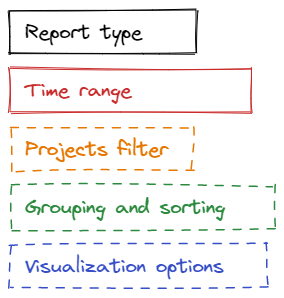
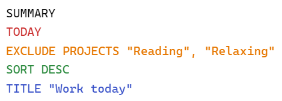
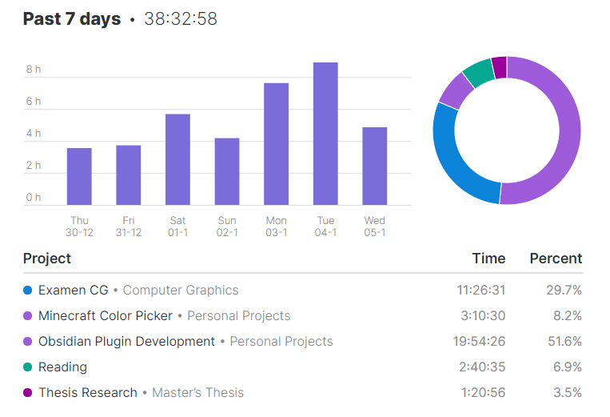
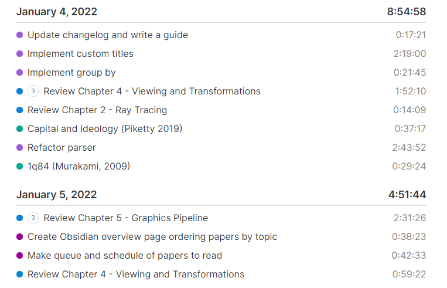
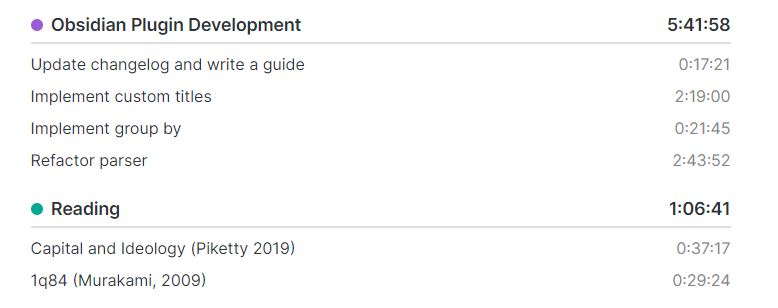
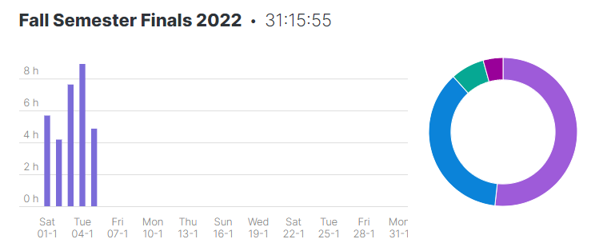

# Toggl Query Language (TQL)

To easily define the scope of your reports and configure them visually, I wrote a tiny query language inspired by [Dataview's DQL](https://blacksmithgu.github.io/obsidian-dataview/query/queries/).

Don't be intimidated by the word "language", there is only a handful of keywords to learn and the resulting query reads more or less like an English sentence.

## Query structure

All queries have the same structure (see diagram). The blocks with dashed lines are optional.



An example of a query using every block:



In reader or live preview mode, this query will render a summary report of today's time entries with a bar chart and pie chart, it will ignore the projects "Reading" and "Relaxing", it will sort the project list in order of descending total time, and it will have a customized title of "Work today".

## Query types

The plugin can generate two types of reports: summaries and lists.

### `SUMMARY`

Summary reports show a bar chart and pie chart breaking down the time spent by day and project over the time range selected.

**Example:**

````
```toggl
SUMMARY
PAST 7 DAYS
```
````

Will result in something like:



### `LIST`

List reports generate a list of time entries recorded over the selected time range. By default, lists are grouped by date, but grouping by project is possibly via the `GROUP BY PROJECT` expression.

**Example:**

````
```toggl
LIST
PAST 2 DAYS
```
````

Will result in something like:



## Time ranges

The query type must always be followed by a time range to have a valid query. The query language supports the following time range expressions:

- `TODAY`
- `WEEK` (this week)
- `MONTH` (this month)
- `PAST ... {DAYS|WEEKS|MONTHS)`
- `FROM ... TO ...`

Time ranges can span at most one year. To select a specific range of dates, year-month-day notation must be used (for example, 2022-01-12 would be January 12, 2022). As an exception, you can also use "TODAY" as the end date of a time range (e.g. `FROM 2022-01-01 TO TODAY`).

**Example:**

This query will generate a summary report for the month of December 2021:

````
```toggl
SUMMARY FROM 2021-12-01 TO 2021-12-31
```
````

Note that you don't need to start the different sections of the query on new lines.

## Filtering projects

By default, reports will include time entries from all projects under your configured workspace. This can be filtered by a filter expression:

`{INCLUDE|EXCLUDE} PROJECTS "Project 1", "Project 2", 123456789`

Projects can be identified by their name, or by their Toggl API ID (useful if you like changing project names but don't want your queries to break). Project names must be enclosed in double quotes.

**Example:**

This query will list all time entries today in the "Reading" project.

````
```toggl
SUMMARY TODAY
INCLUDE PROJECTS "Reading"
```
````

(Note that the PROJECTS keyword is plural even when you only filter by one project!)

## Grouping (only for list reports)

By default, list reports are grouped by date and ordered chronologically. To group by project, the `GROUP BY` expression is used:

`GROUP BY {DATE|PROJECT}`

**Example:**

This query will list all time entries in the past two days in the "Reading" or "Obsidian Plugin Development" projects, grouped by project.

````
```toggl
list
past 2 days
include projects "Reading", "Obsidian Plugin Development"
group by project
```
````

This query will result in something like this:



## Sorting

By default, projects are ordered alphabetically and dates chronologically. Depending on the report type and grouping, sorting does different things:

`SORT {ASC|DESC}`

- In summary reports and list reports grouped by project, sorting sorts the list by total time per project.
- In list reports grouped by date, sorting sorts the list in (reverse) chronological order.

**Example:**

This query lists all time entries in the past 7 days, grouped by date, with the most recent date first:

````
```toggl
LIST PAST 7 DAYS
GROUP BY DATE
SORT DESC
```
````

Note that the `GROUP BY DATE` expression is redundant because this is the default behavior.

## Changing the report appearance

By default, summary reports have a title that reflects the time range of the report query. To change this to a custom title, you can add the following expression at the end of your query:

`TITLE "My title"`

**Example:**

The following query will generate a summary report for the month of January 2022, with the custom title "Fall Semester Finals 2022

````
```toggl
SUMMARY FROM 2022-01-01 TO 2022-01-31
INCLUDE PROJECTS "Examen CG", "Examen QAS"
TITLE "Fall Semester Finals 2022"
```
````

The report's title will look like this:


